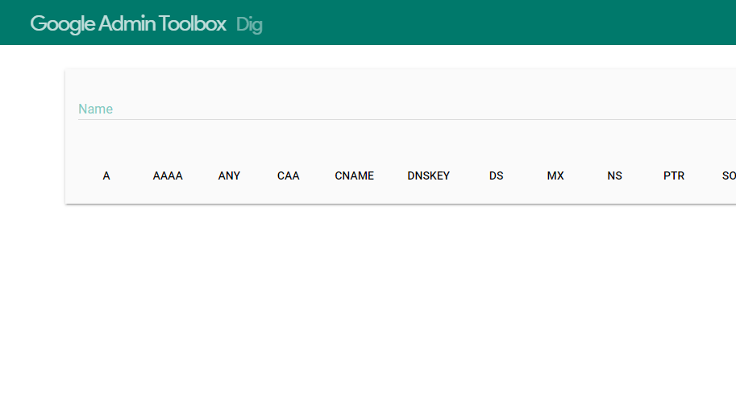
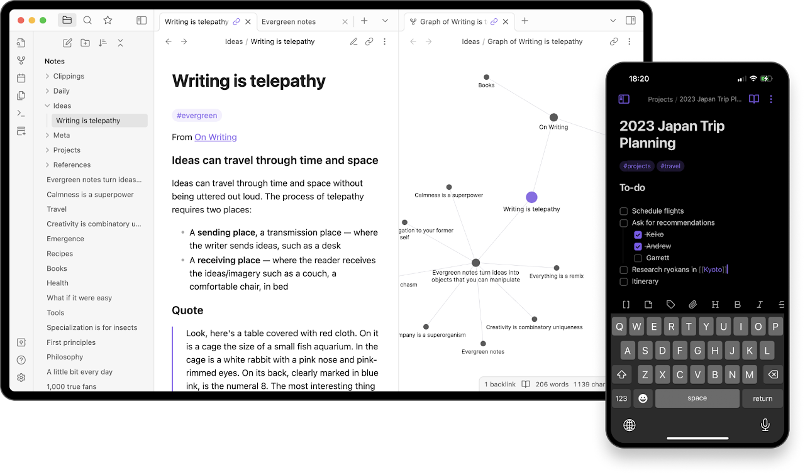

+++
title = 'Tools'
date = 2024-05-06T18:10:38-07:00
description = 'Things I think are neat.'
draft = true
type = 'post'
tags = ['apps']
+++
#### Apache Guacamole (Clientless remote desktop gateway)
Supporting standard remote protocols like VNC, RDP, and SSH.\
https://guacamole.apache.org/

#### Google's Dig webapp (DNS lookup)
Tool for interrogating DNS name servers.\
https://toolbox.googleapps.com/apps/dig/

#### Obsidian
Flexible writing application using markdown, a non-propietary language.\
https://obsidian.md/

