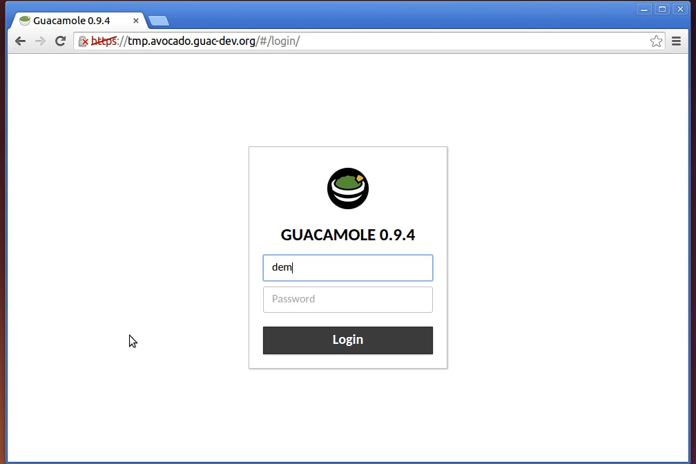
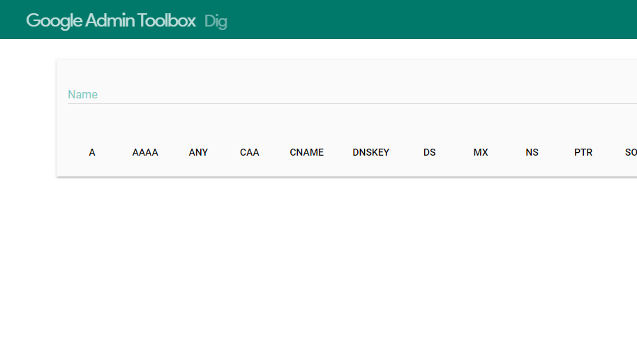
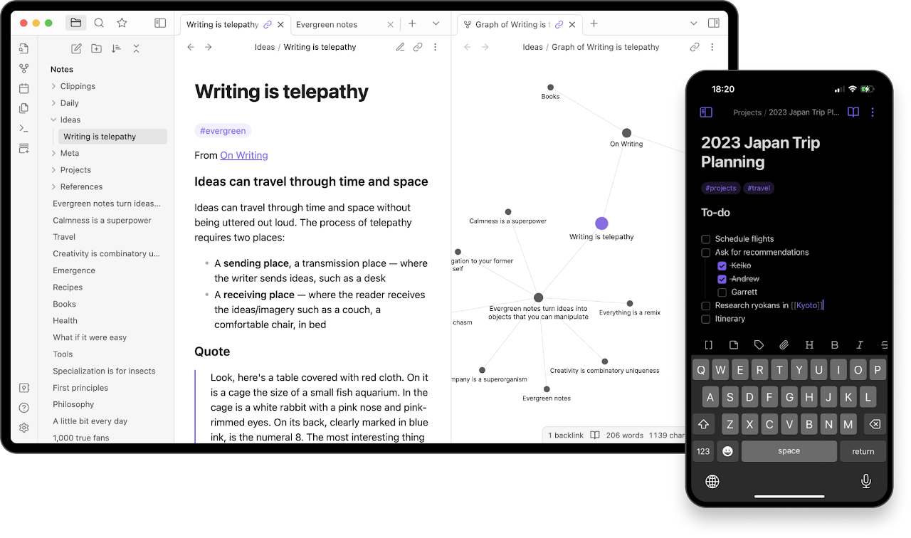

+++
title = 'Tools'
date = 2024-05-06T18:10:38-07:00
description = 'Things I think are neat.'
type = 'post'
tags = ['apps']
+++
#### Apache Guacamole (Clientless remote desktop gateway)
Supporting standard remote protocols like VNC, RDP, and SSH.\
https://guacamole.apache.org/


#### Google's Dig webapp (DNS lookup)
Tool for interrogating DNS name servers.\
https://toolbox.googleapps.com/apps/dig/


#### Obsidian
Flexible writing application using markdown, a non-propietary language.\
https://obsidian.md/


#### Kompose
Docker compose to Kubernetes/Openshift conversion tool.\
https://kompose.io/
```bash
$ kompose convert -f compose.yaml

$ kubectl apply -f .

$ kubectl get pods
NAME                            READY     STATUS              RESTARTS   AGE
frontend-591253677-5t038        1/1       Running             0          10s
redis-leader-2410703502-9hshf   1/1       Running             0          10s
redis-replica-4049176185-hr1lr  1/1       Running             0          10s
```
<sub>While you can get away without a version tag in your compose.yml file for modern docker ce, you will get a complaint from this tool unless you put in a `version:` tag</sub>
